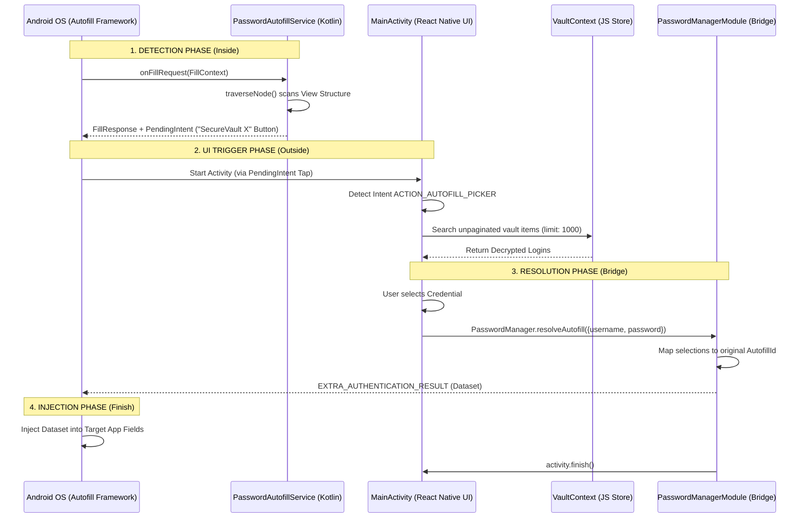

# 🔐 SecureVault X: Android Autofill Technical Manual

Official documentation for the SecureVault X native Autofill integration. This directory contains the Expo Config Plugin and supporting templates that enable system-wide credential injection on Android.

---

## 📖 Table of Contents

1. [Introduction](#-introduction)
2. [Quick Start](#-quick-start)
3. [Architecture: In & Out](#-architecture-in--out)
   - [The Native Layer (Inside)](#the-native-layer-inside)
   - [The JS Bridge (In-Between)](#the-js-bridge-in-between)
   - [The UI/UX Flow (Outside)](#the-uiux-flow-outside)
4. [Security Principles](#-security-principles)
5. [Development & Templates](#-development--templates)

---

## 🌟 Introduction

SecureVault X provides a native-grade, system-wide autofill experience on Android. By leveraging the **Android Autofill Framework** and a custom **Lazy-Fetch Architecture**, we deliver a highly secure, high-performance solution that keeps your decrypted credentials isolated within the React Native layer until the moment they are needed.

---

## ⚡ Quick Start

### 1. Plugin Integration

Add the plugin to your `app.json` or `app.config.js`:

```json
{
  "expo": {
    "plugins": ["./plugins/withPasswordManager"]
  }
}
```

### 2. Synchronization

Run the following command to generate the native files and register the bridge:

```bash
npx expo prebuild
```

---

## 🏗️ Architecture: In & Out

The integration follows a coordinated handshake between the Android OS and React Native.

### 🔄 End-to-End Sequence Flow



### The Native Layer (Inside)

Located in `android/app/src/main/java/.../autofill/`, this layer communicates directly with the OS.

- **`PasswordAutofillService.kt`**: Scans the third-party app's view tree to detect `username` and `password` fields using `AssistStructure.ViewNode`.
- **`PasswordManagerPackage.kt`**: Registers the native module within the React instance.

### The JS Bridge (In-Between)

Generated in `src/utils/native-bridges/PasswordManager.ts`, this is the unified interface between Native and JS.

```typescript
export interface Credential {
  id: string; // Used for stable React rendering and matching
  username: string; // Final text to be injected
  password?: string;
}

export const PasswordManager = {
  resolveAutofill: (c: Credential) => Native.resolveAutofill(c.username, c.password),
};
```

### The UI/UX Flow (Outside)

The `AutofillPicker.tsx` component is the face of the architecture. It features:

- **Liquid Glass Design:** A high-performance, animation-driven bottom sheet using Reanimated 3.
- **Translucent Overlay:** The `Theme.App.Translucent` style allows our RN UI to float seamlessly over third-party apps.

---

## 🔒 Security Principles

- **Lazy-Fetch:** Unlike standard password managers, we do **not** store decrypted credentials in native memory or disk caches. We fetch them directly from the secure React Native store only after the user triggers the picker.
- **Biometric Gating:** The entire picker flow is protected by a hardening biometric gate that must be passed before credentials are revealed.
- **Scope Isolation:** Our `AutofillService` uses a custom `Authentication` flow, which means the OS receives **zero data** until the user confirms a selection inside our app.

---

## 🛠️ Development & Templates

The native bridge is managed via **Templates** in the `plugins/templates/` folder. Modifying these templates allows for easy cross-project updates:

1.  **`PasswordAutofillService.kt`**: Update this to refine field detection heuristics.
2.  **`PasswordManagerModule.kt`**: Update this to handle more complex multi-step resolution.
3.  **`PasswordManager.ts`**: Update this to refine types and bridge contracts.

> [!TIP]
> **Pro-Tip:** Always run `npx expo prebuild` after modifying templates to synchronize changes to the native Android source sets.

---

## ❓ FAQ & Troubleshooting

**Q: The picker doesn't open when tapping a login field.**
A: Ensure that SecureVault X is enabled as your device's default Autofill Service in Android Settings.

**Q: The picker opens but doesn't find my login.**
A: Check that the website/app URL is correctly saved in your vault. We use high-performance fuzzy matching to find unpaginated results.

**Q: Why does the app flash when opening?**
A: This has been addressed in the latest interpolation logic within `AutofillPicker.tsx`. Verify you have the "Liquid Glass" animation enhancements applied.

---

_Built with ❤️ for SecureVault X_
